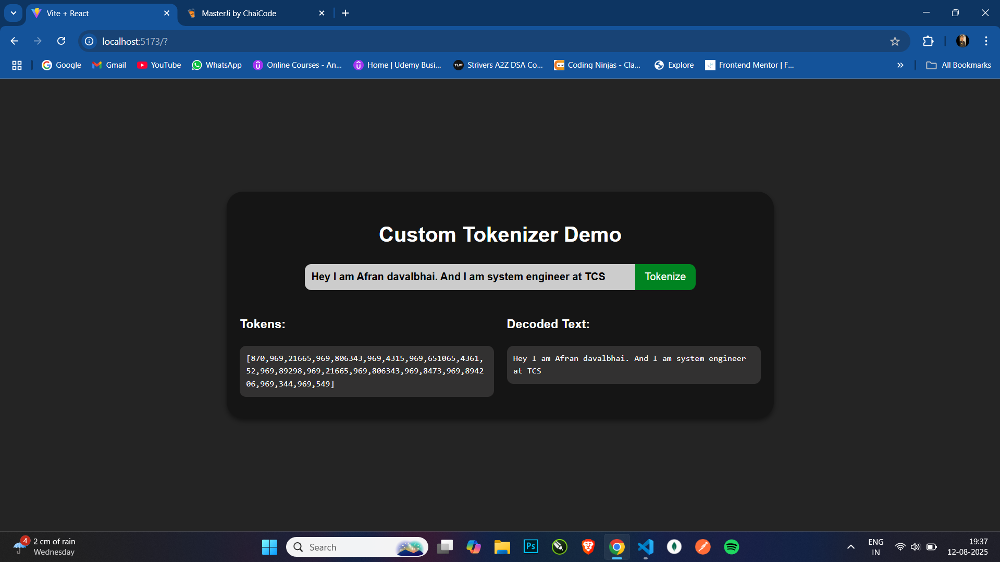

# Custom Tokenizer Demo (GenAI Learning Project)

This project is a **beginner-friendly demonstration** of how tokenization works in the context of **Generative AI**.  
It simulates the way Large Language Models (LLMs) like GPT handle text before feeding it into their neural networks.

## 📌 What is Tokenization?

In Generative AI, **tokenization** is the process of converting human-readable text into a sequence of tokens (numbers).  
These tokens are the **basic units** an LLM understands. For example:

This project doesn't use advanced libraries like `tiktoken`. Instead, it **builds a simple tokenizer from scratch** in JavaScript to help understand the underlying logic.

## 🛠 How It Works

### 1. `CustomTokenizer` Class
- **`encode(text)`** → Splits input text into tokens based on spaces and punctuation.  
  - Assigns each token a **random numeric ID**.
  - Stores token-to-ID and ID-to-token mappings.
- **`decode(tokenIds)`** → Converts numeric IDs back into the original string.
- Uses a **map-like structure** to keep track of unique tokens and their IDs.

### 2. React Frontend
- **Input field** → Type any sentence you want to tokenize.
- **Tokenize button** → Runs the `encode()` method and displays the numeric tokens.
- **Decoded text** → Uses `decode()` to convert tokens back into the original text.

---

## 🚀 Why This Matters for GenAI
Understanding tokenization is **foundational** to working with LLMs:
- GPT models **don’t process raw text** — they work with token IDs.
- Tokenization affects **model cost, context length, and accuracy**.
- By building a simple tokenizer, we demystify what’s happening before text even reaches the model.

---

## 📷 Demo Screenshot

